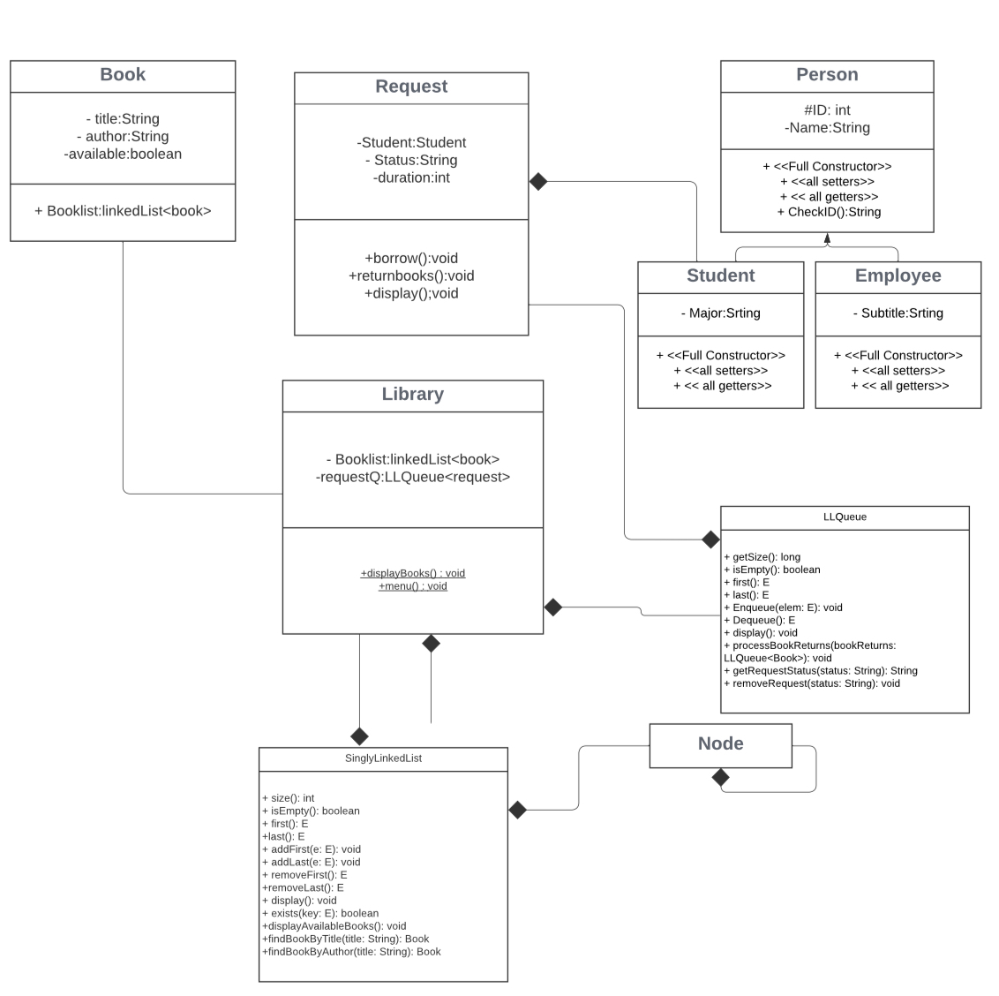

# Library Management System (Java)

A console-based library management system developed in Java to manage book borrowing and returning for students and employees. Built using object-oriented programming and custom data structures like linked lists and queues.

## Features
- Add and manage books
- Borrow and return books by request
- View available books
- Track borrowing requests using a custom queue

## Technologies Used
- Java
- OOP (Object-Oriented Programming)
- Custom LinkedList and Queue implementation

## Class Highlights
- `Book.java`: Book information and availability
- `Person.java`: Base class for `Student` and `Employee`
- `Request.java`: Handles book borrowing requests
- `Library.java`: Main controller for library operations
- `LLQueue.java`: Queue to manage book requests
- `LinkedList.java`: Singly linked list for book collection

## How to Run
1. Open the project in any Java IDE (e.g., IntelliJ IDEA, Eclipse, NetBeans)
2. Compile all `.java` files
3. Run the main class (`Library.java`) from the console

## UML/Class Diagram

